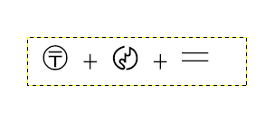
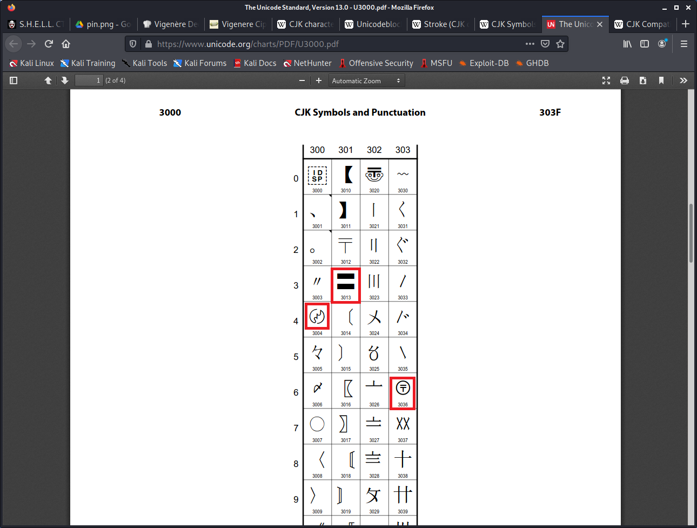
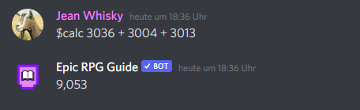

# CJK

We are given an png with symbols to find a PIN:

The title CJK gives us a hint to find the symbols in unicode: https://en.wikipedia.org/wiki/CJK_characters

Now we can search for a specific cutout for CJK-Symbols in unicode and search around that area: https://www.unicode.org/charts/PDF/U3000.pdf

Now we can sum the values:

This number is the PIN we can use for the flag: SHELL{9053}
