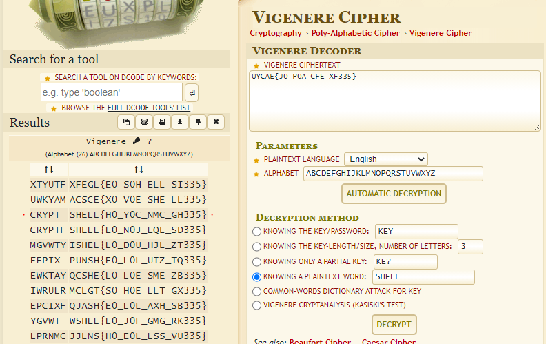
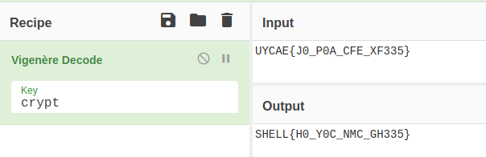
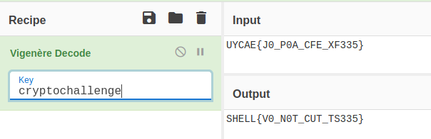
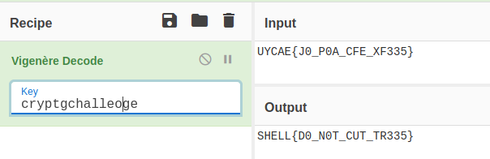

# Poly-Alpha

We are given a flag like this:
```
UYCAE{J0_P0A_CFE_XF335}
```
The challenge name tells us that it is something about a poly-alphabetic cypher so we try to solve it online automatically.

I like using this tool: https://www.dcode.fr/vigenere-cipher.
We can use what we already know - the beginning of the flag in plaintext "SHELL":



But that's not the whole answere, as the flag is still not readable. So I guessed around in CyberChef:



I had some ideas with different keys. One of it was "cryptochallenge":



This look right in some parts with that "NOT CUT"... I guessed there is something like "DO NOT CUT" and the word at the end could be "knees" or "trees". In terms of "do not cut", "trees" could be fine. Figuering around I got the flag, but this was really try 'n error as the keyword became "crptgchalleoge":


