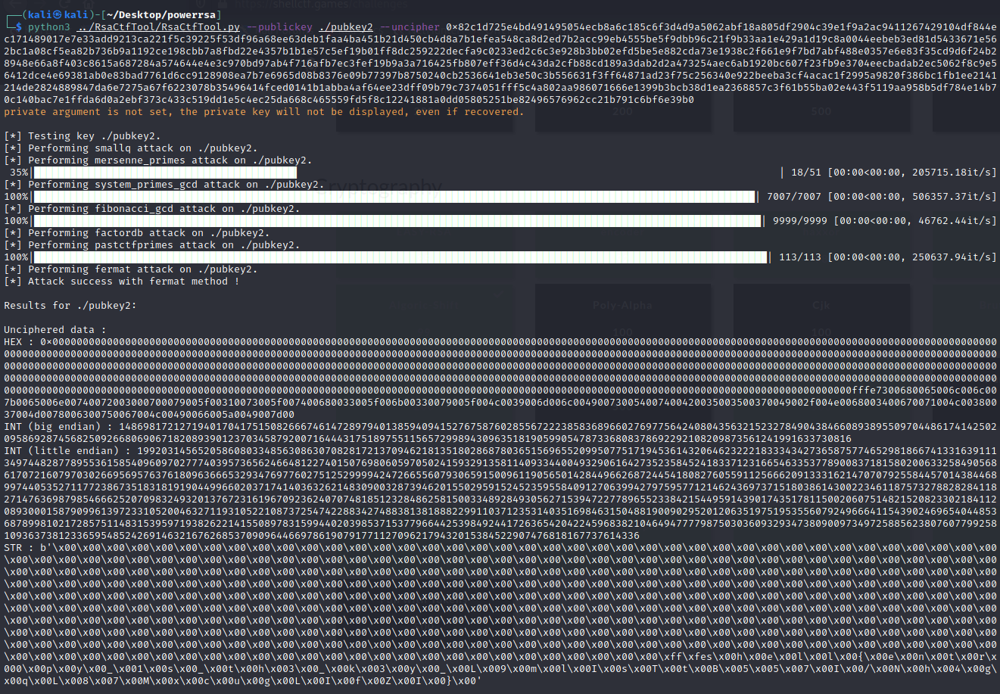

# PowerRSA
```
Something's not quite secure.
nc 34.92.214.217 8887
Flag format : shell{}
```

Connecting to the nc we get:

```bash
(kali㉿kali)-[~]
└─$ nc 34.92.214.217 8887 
Public Key = 
-----BEGIN PUBLIC KEY-----
MIICIjANBgkqhkiG9w0BAQEFAAOCAg8AMIICCgKCAgEAkDRBfIUVxiev9UOByDCi
e58tKflLW/MvPxpeEZ6PmOvfaLObVcui7CGopK+Wuvm6wS7TaJYnOjyii6C37We6
8pZ/oxe87ZvPEt8MSOTsvR0gg24zFNzzC/KBdGhx2HPsxJfpKAxRVCfFUpfvvAxY
zFqQFlpNXprX2NHMwBdU5sbofNbHfCCWhTlh9iVdZMyZJDxx11F+uYgHwEwTVxgp
Ab17aIaehAZzx3pqUat9BJI3IKU8z0g5dzBZHgLI5HQ6fo8+8qc5cH+uFXhTanpZ
NNu42eeqwcaocxESfRdSMGpptCROe7G4VtH4ERUfNbhYxWYc15voaq/iN5+oHsNH
xTw1knfPHbCFr52mlA88SFOvhLqIbqTE7+j04UrzenI/8Y5Z00thNZVWsAQMPU9Y
tiC3eOGXFRhFlwdIlqhQkEEq9VMODe7lTMHLOQg9g1V2eoMf6J1SBcDCTHio73mu
snldfJVLpQ6GTQnakKee8QqmEKOnKeAyECyVRiWepDtm+t3KVLFCJQsFrrloGGdB
tXlbwV8eokAC84figkp52SShKP/i+g6q13OtmE4ezTEm7yBTWg6L96u63sWDEush
jUaqWEwIKTGuUmv8YxTiRH5sgdt71Qb5RSdj355li8R6w3IKQ2vIrJBIdPNbDrvE
Bcd6xhH5CpM/AnOJFDlkxjECAwEAAQ==
-----END PUBLIC KEY-----
Encrypted Flag = 0x82c1d725e4bd491495054ecb8a6c185c6f3d4d9a5062abf18a87e7e33add9213ca221f5c39225f53df96a68ee63deb1faa4ba451b21d450cb4d8a7b1e1e429a1d19c8a0044eebeb3ed81d5433671e562bc1a08cf5ea82b736b9a1192ce198cbc0233ed2c6c3e928b3bb02efd5be5e882cda73e1938c2f661e9f7bd7abf488e0357e6ee4e3c970bd97ab4f716afb7ec3fef19b9a3a716425fb807eff36d4c43da2cfb88cd189ab2ec5062f8c9e56412dce4e69381ab0e83bad7761d6cc9128908ea7b7e6965d08b8374871ad23f75c256340e922beeba3cf4acac1f2995a9820f386bc1fb1ee2141214de282ba4af64ee23dff09b79c7374051fff5c4a802aa986071666e1399b3bcb38d1ea2368857e1ffda6d0a2ebf373c433c519dd1e5c4ec25da668c465559fd5f8c12241881a0dd058
```

This is enough to feed the awesome RsaCtfToolkit  (https://github.com/sourcekris/RsaCtfTool or https://github.com/Headorteil/RsaCtfTool):


