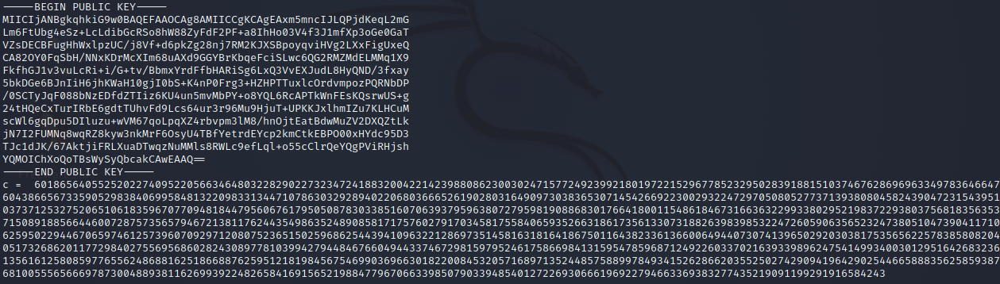
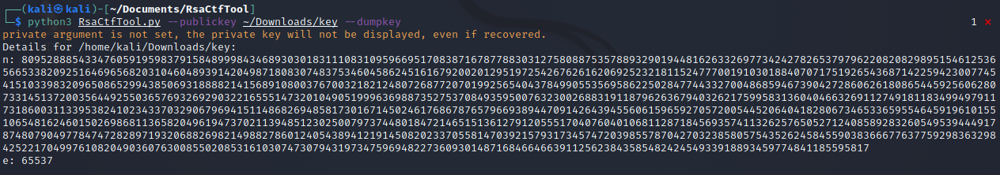

# Puny Factors

In this challenge we need to connect to the IP 34.92.214.217 8889 and get the following response:


A public RSA key and the encrypted flag.

On the server the following python script is running:
```python
from Crypto.Util.number import getPrime,inverse,long_to_bytes,bytes_to_long
from Crypto.PublicKey import RSA
flag = "shellctf{something_here}"

n = getPrime(4096)
e = 65537
phi = (n-1)*(n-1)
d = inverse(e,phi)

encrypted_flag = pow(bytes_to_long(flag.encode()),e,n)

decrypted_flag = long_to_bytes(pow(encrypted_flag,d,n)).decode()

assert decrypted_flag == flag 
print(RSA.construct((n,e)).publickey().exportKey().decode())
print("c = ",encrypted_flag)
```

We can see, that `n` is a prime number and not calculated by two huge prime numbers, like it is supposed to. We also see, that `phi = (n-1)(n-1)`.
This means, if we are able to extract `n` out of the public key, we can use it to calculate `d`, which is the private key.

`n` can be extracted using the tool `RsaCtfTool`:



Now we can simply edit the given script and insert our dumped `n` and the encrypted flag `c`
```python
from Crypto.Util.number import getPrime,inverse,long_to_bytes,bytes_to_long
from Crypto.PublicKey import RSA
flag = "shellctf{something_here}"

n = 809528885433476059195983791584899984346893030183111083109596695170838716787788303127580887535788932901944816263326977342427826537979622082082989515461253656653382092516469656820310460489391420498718083074837534604586245161679200201295197254267626162069252321811524777001910301884070717519265436871422594230077454151033983209650865299438506931888821415689108003767003218212480726877207019925654043784990553569586225028477443327004868594673904272860626180865445925606280733145137200356449255036576932692903221655514732010490519996369887352753708493595007632300268831911879626367940326217599583136040466326911274918118349949791173186003113395382410234337032906796941511486826948581730167145024617686787657966938944709142643945560615965927057200544520640418280673465336595546459196101551065481624601502698681136582049619473702113948512302500797374480184721465151361279120555170407604010681128718456935741132625765052712408589283260549539444917874807904977847472828971932068826982149882786012405438941219145082023370558147039215793173457472039855787042703238580575435262458455903836667763775929836329842522170499761082049036076300855020853161030747307943197347596948227360930148716846646639112562384358548242454933918893459774841185595817
e = 65537
phi = (n-1)*(n-1)
d = inverse(e,phi)

encrypted_flag = 601865640552520227409522056634648032282902273234724188320042214239880862300302471577249239921801972215296778523295028391881510374676286969633497836466476043866567335905298384069958481322098331344710786303292894022068036665261902803164909730383653071454266922300293224729705080527737139380804582439047231543951037371253275206510618359670770948184479560676179505087830338516070639379596380727959819088683017664180011548618467316636322993380295219837229380375681835635371508918856644600728757356579467213811762443549863524890858171757602791703458175584065935266318617356133073188263983985322472605906356523247380510473904117106259502294467065974612573960709297120807523651502596862544394109632212869735145816318164186750116438233613660064944073074139650292030381753565622578385808204051732686201177298402755695686028243089778103994279448467660494433746729815979524617586698413159547859687124922603370216393398962475414993400301295164268323613561612580859776556248688162518668876259512181984567546990369663018220084532057168971352448575889978493415262866203552502742909419642902544665888356258593876810055565666978730048893811626993922482658416915652198847796706633985079033948540127226930666196922794663369383277435219091199291916584243

decrypted_flag = long_to_bytes(pow(encrypted_flag,d,n)).decode()

print(decrypted_flag)
```

Running the script, gives us the flag:
```
shellctf{pr1m3s_ar3_sup3r_int3re$tinG}
```
