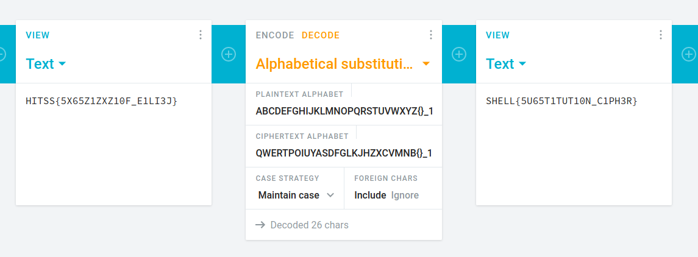

# Subsi

In this challenge we are given an encrypted flag:
```
HITSS{5X65Z1ZXZ10F_E1LI3J}
```

and a python script that contains the encryption algorithm:
```python
alpha = 'ABCDEFGHIJKLMNOPQRSTUVWXYZ{}_1234567890'
key   = 'QWERTPOIUYASDFGLKJHZXCVMNB{}_1234567890'

text = <flag>

def encrypter(text,key):
    encrypted_msg = ''
    for i in text:
        index = alpha.index(i)
        encrypted_msg += key[index]
    # print(encrypted_msg)
    return encrypted_msg
```

The algortihm looks like a simple substitution of characters. Even the key that was used is given.
With that information we can put the information in a decoder and decrypt the flag:



The flag can now be turned in:
```
SHELL{5U65T1TUT10N_C1PH3R}
```
