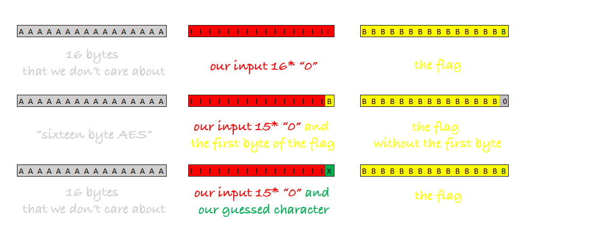

# Challenge Name
```
This implementation of AES is breakable, but how ?
I set it up at : nc 34.92.214.217 8885

Note : May need to use automation scripts.
Flag format : shell{} and its 16 chars in length
```
We are given a netcat address and port and also the [script](encrypt.py) that is running on it.

So looking at the encrypt.py on the server:
```py
sitrep = str(input("Crewmate! enter your situation report: "))
message = '''sixteen byte AES{sitrep}{secret_code}'''.format(sitrep = sitrep, secret_code = secret_code) #the message is like [16-bytes]/[report]/[flag]
```

We see that the server takes our input and then craft the message that later gets send back to us like it says in the comment:
```py
"sixteen byte AES" + "our input" + "the flag"
```

We also know from the challenge description that the flag is 16 chars long aswell, just as the string "systeen byte AES". So essentially we have this structure:
[16bytes block] + [our input] + [16 bytes flag].

We also see in the encrypt.py on the server:
```py
def encrypt(key, plain):
    cipher = AES.new( key, AES.MODE_ECB )
    return cipher.encrypt(plain)
```
that it is using AES in ECB mode to encrypt the message. To go further we need to understand how that works.



So essentially in our the cypher devides the constructed string into block of 16 bytes and encodes them with the key.
We can abuse this to enumerate the flag in these simple steps:

When we send 15 Bytes, 15 * "0" for example, we know that because of the structure  [16bytes block] + [our input] + [16 bytes flag] the first byte of the flag is suddenly in the block of our input when it comes to encryption. So when it gets encryption the 16byte block in the middle looks like this: 

```py
"sixteen byte AES" + "000000000000000S" + "hell{rest of flag}"
```

because we know our flag format is "SHELL{s0m3_th1ng_h3r3}". But the flag format doesn't matter this works for any flag.

So if we send the input "000000000000000" we know that essentially the middle block becomes "000000000000000 + first byte of flag" = "000000000000000S". That means now we can brute force the first byte of the flag by sending 15 * "0" + A and compares that with what we got by sending 15 zeros only. If it matches this has to be our first byte. If it doesn't we just send the next letter so 15 * "0" + B for example. Until we got our first byte. After that we can continue to enumerate the second byte of the flag following the same technique. Now we send 14 * "0" + S (because we now know the first by is S) + A and compares that to our previous response. If it doesn't match we will send 14 * "0" + S + B etc. until we have recovered the complete Flag.

Alright after we understood how it works, let's write the script for it:

We will use the [pwntools](https://docs.pwntools.com/en/stable/index.html) and populate our host and port variable. Also to speed things up a little and we already know the format of the flag we will give ourselves a headstart by setting our flag to 'shell{'.
```py
from pwn import *

host = '34.92.214.217'
port = 8885

flag = 'shell{'
```
Now we start our outer loop, this is where we send the payload and save it to the variable prov_result to compare it later with the response. In this scenario we had to decode it from base64 and strip it etc. that's not so interesting.

```py
while True:
    t = remote(host, port)
    payload = "0"*(15-len(flag))
    t.recvuntil(':')
    t.sendline(payload)
    prov_result = t.recvall()
    prov_result = base64.b64decode(prov_result).hex()
    prov_result = prov_result[33:-32]
```
This is our inner loop, here we test every character, in our case the ascii characters from 45 to 125, send it to the host together with the payload and what we have enumerated from the flag so far:
```py
    for i in range(45, 125):
        print('Testing Character:' + chr(i))
        print("Flag: ", flag)
        t = remote(host, port)
        t.recvuntil(': ')
        print('sending....: ' + payload + flag + chr(i))
        t.sendline(payload + flag + chr(i))
        encoded = t.recvall()
        encoded = base64.b64decode(encoded).hex()
```
We then compare our initial prov_result with the response for the actual character and check if they match. If not the loop starts over again, but if we have a match we break out of the inner loop to continue with the next byte. At the end we check if we reached the end of the flag but that is totally unnecessary as we have numerous prints anyways and constantly see our result.

```py
        print('ich vergleiche: ' + encoded[33:-32] + ' mit: ' + prov_result)
        if encoded[33:-32] == prov_result:
            flag += chr(i)
            print("Flag: ", flag)
            break
    if len(flag) == 16:
        break
print(flag)
```
Now we just let it run until we received the whole flag.

[Final Script](vulnaes.py)
```py
from pwn import *

host = '34.92.214.217'
port = 8885

flag = 'shell{'

while True:
    t = remote(host, port)
    payload = "0"*(15-len(flag))
    t.recvuntil(':')
    t.sendline(payload)
    prov_result = t.recvall()
    prov_result = base64.b64decode(prov_result).hex()
    prov_result = prov_result[33:-32]

    for i in range(45, 125):
        print('Testing Character:' + chr(i))
        print("Flag: ", flag)
        t = remote(host, port)
        t.recvuntil(': ')
        print('sending....: ' + payload + flag + chr(i))
        t.sendline(payload + flag + chr(i))
        encoded = t.recvall()
        encoded = base64.b64decode(encoded).hex()
        print('ich vergleiche: ' + encoded[33:-32] + ' mit: ' + prov_result)

        if encoded[33:-32] == prov_result:
            flag += chr(i)
            print("Flag: ", flag)
            break
    if len(flag) == 16:
        break
print(flag)
```