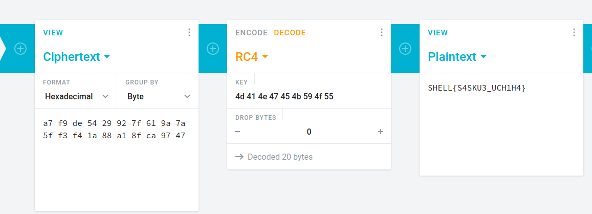

# arc-cipher
In this challenge we were given an encrypted message:
```
a7 f9 de 54 29 92 7f 61 9a 7a 5f f3 f4 1a 88 a1 8f ca 97 47
```
and a python script:
```python
text = "<flag>"
key = "MANGEKYOU"

s = []

k = []

for i in key:
    k.append(((ord(i))))

for i in range(0,256):
    s.append(i) # i.e. s = [0 1 2 3 4 5 6 7 ..]
    if i >= len(key):
        k.append(k[i%len(key)])

def key_sche(s,k):
    j = 0
    for i in range(0,256):
        j = (j + s[i] + k[i])%256
        temp = s[i]
        s[i] = s[j]
        s[j] = temp
        # print("s in the iteration:",i+1," is :",s)
    return s
def key_stream(text,s):
    ks = []
    i = 0
    j = 0
    status = 1
    while(status == 1):
        i = (i+1) % 256
        j = (j+s[i])%256
        s[i],s[j] = s[j],s[i]
        t = (s[i]+s[j])%256
        ks.append(s[t])
        if len(ks) == len(text):
            status = 0
    return ks

def encrypt(text,k):
    encrypted_txt = ''
    hex_enc_txt = ''
    for i in range(0,len(text)):
        xored = (ord(text[i])) ^ (k[i])
        encrypted_txt +=  chr(xored)
        hex_enc_txt += hex(xored)[2:] + ' '
    li = list(hex_enc_txt)
    li.pop()
    hex_enc_txt = ''.join(li)
    return encrypted_txt,hex_enc_txt

key_new = key_stream(text,key_sche(s,k))
ciphered_txt,ciphered_hex = encrypt(text,key_new)
print("ciphered hex : ",ciphered_hex)
print("ciphered text : ",ciphered_txt)
```

Because the Challenge name is `arc-cipher` we googled it. Turns out it is RC4. 
After confirming, that the RC4 alrogithm looks similar to the algorithm used in the python script, we can use a RC4 Decoder.
For that we convert the given key `MANGEKYOU` to hex and get the flag:



The flag can be submitted now:
```
SHELL{S4SKU3_UCH1H4}
```
