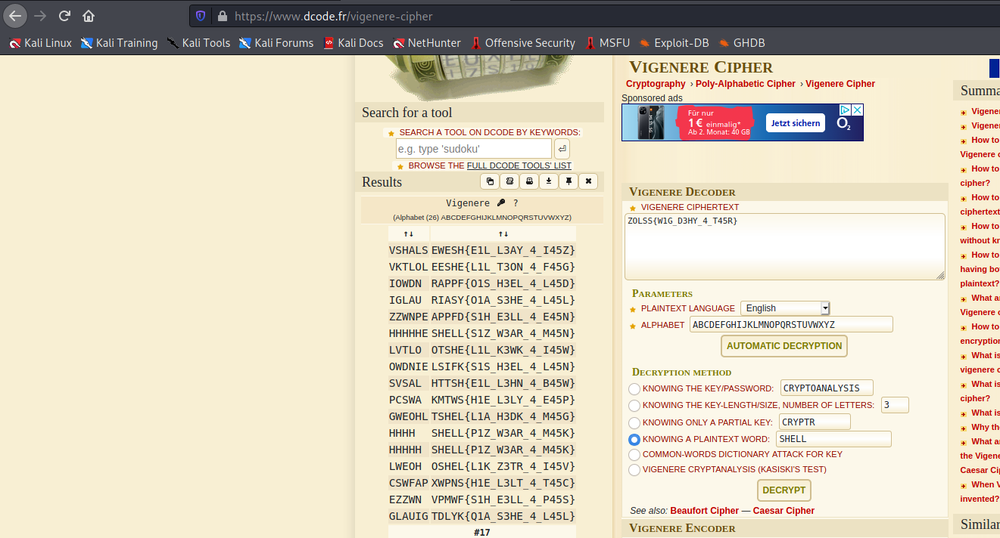

# encoder

We are given following task:
```
can you decrypt this text : "ZOLSS{W1G_D3HY_4_T45R}"

NOTE: do not shift the numbers and the special charecters( '{' , '}' , '_' ).
```

What we know is that the flag has to start with "SHELL" so we just need to put it into: http://dcode.fr/vigenere-sipher



One of the solutions is SHELL{PlZ_W3AR_4_M45K}
