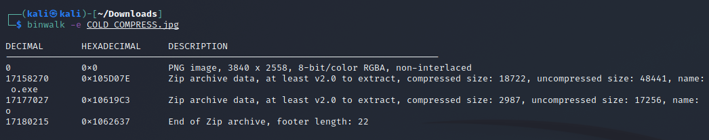
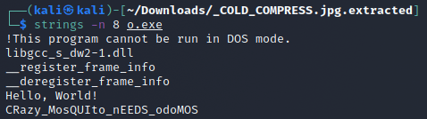

# Cold Compress Inside

We are given [this image](COLD_COMPRESS.jpeg).
Running `file` on it quickly tells us it's a PNG even though it has .jpeg extension.

As the name suggests already we already assume that there is nother file hidden inside of it. So we run binwalk on it:

We extracted a o.exe let's just run `string -n 8 o.exe` on it:

