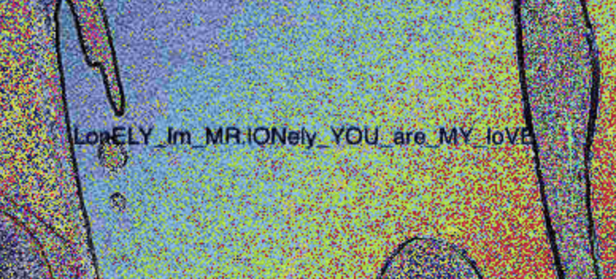

# Grass is green

We are given [this image](grass_is_green.jpeg) (you can already read it if your monitor and your eyes aren't shit)
I still uploaded it to https://stegonline.georgeom.net/image.

When I inspected the LSB half view of it I noticed the flag in the upper left corner:

