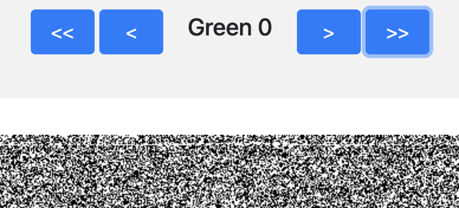
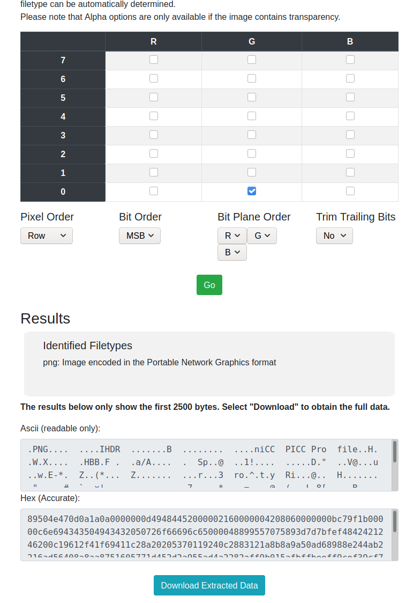

# Hidden Inside 2

We were provided [this image](HIDDEN_INSIDE_2.jpeg).

It says .jpeg but running `file` on it tells us it's a PNG. So I upload it to https://stegonline.georgeom.net/upload to test different thing on it.

While browsing the bit planes I've noticed a thin line on the green layer 0:

So I switched to extract data and selected that layer:

The result had a PNG magic number so I downloaded it:

