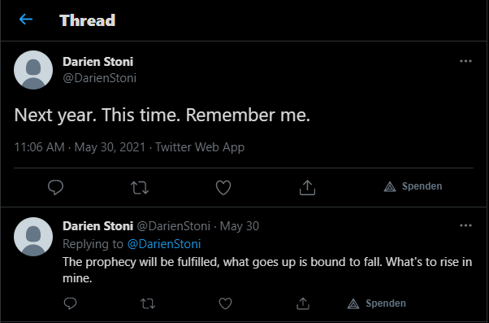

# Cyber Attack 1

```
We have top secret confidential information from the secret service that there is going to be an all out cyber attack against a country in the future. Long Live our spy who died in between the transmission.

The FBI have found that the following tools will be used in attack on the country.Use this GitHub repo as a starting point for your investigation https://github.com/norias-teind/tools
All we ask from you is Time and Date of Attack SHELL{HH:MM;DD/MM/YYYY}

Update:- Time in IST time zone.
```

So this is an OSINT challenge and we have to find the date of the attack. The other challanges have the same git as origin but are searching for "Country of the attacker", "Country of attack" and "Name of the attacker". Look in Cyber Attack 2 - 4 to learn about these paths.

The linked Git is a tools repository with the code of the LOIC (Low Orbit Ion Cannon) in it. Looking inside the LOIC directory we find a README.md that's a little bit changed to the original README.md of the LOIC. 
There is a line added that tells us:
```
For code examples check https://realantwohnette.wordpress.com
```
https://realantwohnette.wordpress.com is a wordpress page with some articles. At the bottom of the page we find a link to a twitter account:


Following this we get an account with many tweets:


Searching many posts and replies we found one tweet of interest:



That tweet we can use to craft the flag. With the hint "Time in IST" (India) of the challenge description we need to change the time from our device-time to the Indian time and add one year:
```
SHELL{14:36;30/05/2022}
```
