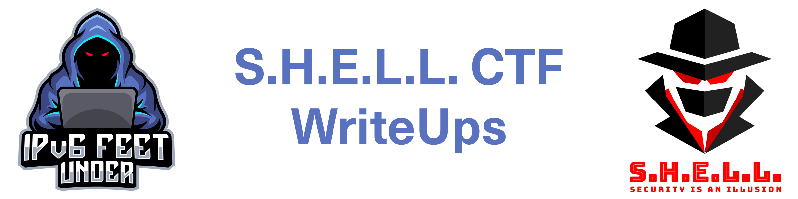
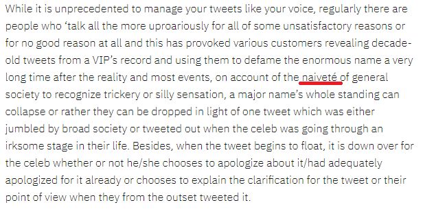

# Cyber Attack 2

```
We have top secret confidential information from the secret service that there is going to be an all out cyber attack against a country in the future. Long Live our spy who died in between the transmission.

The FBI have found that the following tools will be used in attack on the country.Use this GitHub repo as a starting point for your investigation https://github.com/norias-teind/tools
All we ask from you is Country Of Origin of Attacker
e.g. SHELL{Country}
```

So this is an OSINT challenge and we have to find the country of the attacker. The other challanges have the same git as origin but are searching for "Date of the attack", "Country of attack" and "Name of the attacker". Look in Cyber Attack 1, 3, 4 to learn about these paths.

The linked Git is a tools repository with the code of the LOIC (Low Orbit Ion Cannon) in it. Looking inside the LOIC directory we find a README.md that's a little bit changed to the original README.md of the LOIC. 
There is a line added that tells us:
```
For code examples check https://realantwohnette.wordpress.com
```

https://realantwohnette.wordpress.com is a wordpress page with some articles.
In these articles we found a hint to guess the origin of the attacker.
"Cancel Culture, the Tumor in Twitter" has a foreign word in it:



That looks like a french spelling, so it can lead us to the origin of the author: SHELL{France}
