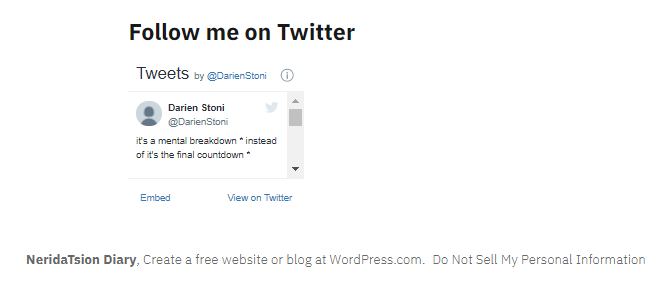

# Cyber Attack 3

```
We have top secret confidential information from the secret service that there is going to be an all out cyber attack against a country in the future. Long Live our spy who died in between the transmission.

The FBI have found that the following tools will be used in attack on the country.Use this GitHub repo as a starting point for your investigation https://github.com/norias-teind/tools
All we ask from you is Time and Date of Attack SHELL{HH:MM;DD/MM/YYYY}

Update:- Time in IST time zone.
```

So this is an OSINT challenge and we have to find the name of the attacker. The other challanges have the same git as origin but are searching for "Country of the attacker", "Country of attack" and "Date of the attack". Look in Cyber Attack 2 - 4 to learn about these paths.

The linked Git is a tools repository with the code of the LOIC (Low Orbit Ion Cannon) in it. Looking inside the LOIC directory we find a README.md that's a little bit changed to the original README.md of the LOIC. 
There is a line added that tells us:
```
For code examples check https://realantwohnette.wordpress.com
```
https://realantwohnette.wordpress.com is a wordpress page with some articles. At the bottom of the page we find a link to a twitter account:



So we got three names: <br>

|Origin |Name  |
--- | --- |
|Twitter|DarienStoni|
|Wordpress|NeridaTsion|
|GitHub|norias-teind|

According to these 3 names and the article about anagrams his/her real name should be an anagram of these names too.
To be honest this was really guessy as there are MANY (even French) possible names and we tried like 200 false flags. But there wasn't any other hint so we finnally got:
SHELL{andrei_ostin}
