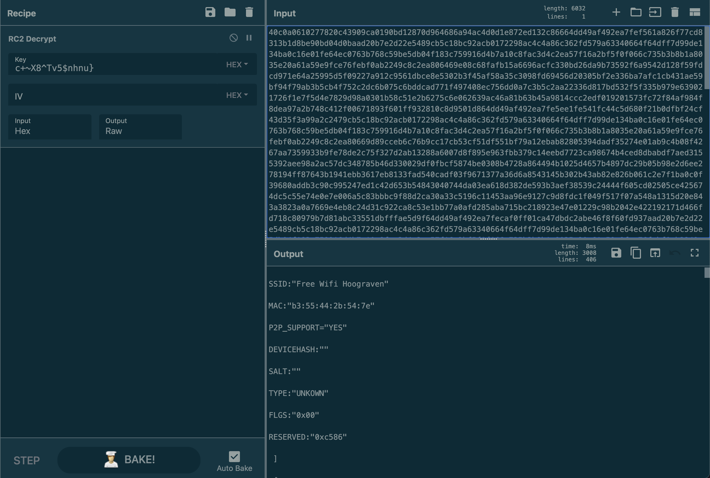
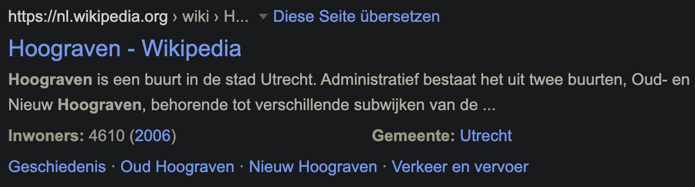

# Cyber Attack 4

https://github.com/norias-teind/tools is our entrypoint again.

There is an evil number in the .gitignore file at https://github.com/norias-teind/tools/blob/main/.gitignore
And at the website that we already needed for Cyber Attack 1 - 3 which was found in the commits: https://realantwohnette.wordpress.com is a strange Cars 2 background. Which is really odd since there is literally nothing else related to that topic at all. So we figured this has to be a hint to something. What sounds easy now took us an eternity, but the background is supposed to be a hint to the "C2 Cipher".

There is also a blog entry in which he says that `c+~X8^Tv5$nhnu}`is a robust password. So let's put these information together in [Cyberchef](https://gchq.github.io/CyberChef/):

The result is a list of WiFi Networks where the first is `SSID:"Free Wifi Hoograven"`.

Searching google reveals that it is in the Netherlands.

SHELL{Netherlands}