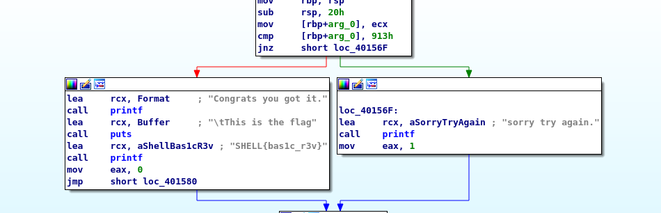

# check_flag

In this Challenge we were given an executable to analyse.
After downloading the executable the first step was to open it up in IDA and looking for some hard coded passes or checks



Here we see the main function of the executable.
As we can see the flag is hard coded into the executable and we can submit the flag
```
SHELL{bas1c_r3v}
```
