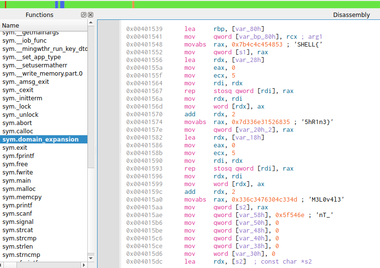
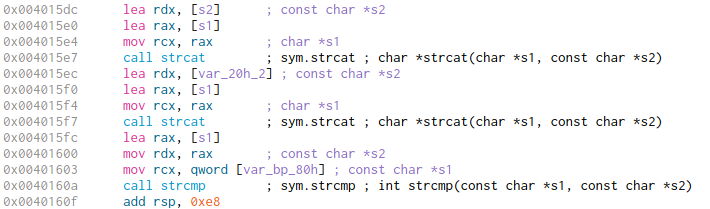

# sakuna

In this challenge we were given an executable.
For analyzing this executable we used `cutter`.
Opening the executable in `cutter`, we quickly discovered that the `main()` function calls the `domain_expression` function.
When we navigate into the function, we are presented with bits of the flag:



We now need to correctly assemble the flag together. For that we can use the `strcat` function that is used:



`SHELL{` is stored in `[s1]`

`5hR1n3}` is stored in `[var_20h_2]`

`M3L0v4l3` is stored in `[s2]`

`nT_` is stored in `[var_58h]`

The first parameter of the `strcat` function is `rcx`, the second is `rdx`
Following the Assembly instructions we can now construct the flag step by step:

```
SHELL{M3L0v413nT_5hR1n3}
```

