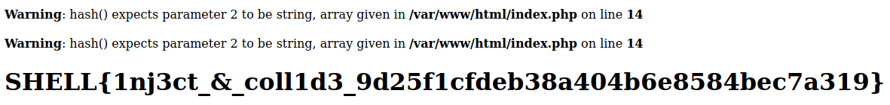

# Collide
### Make sha256 collide and you shall be rewarded 

Visiting the provided website we are presented with the source of the php running on the server:
```php
 <?php
            $source = show_source("index.php", true);
            echo("<div>");
            print $source;
            echo("</div>");

            if (isset($_GET['shell']) && isset($_GET['pwn'])) {
                if ($_GET['shell'] !== $_GET['pwn'] && hash("sha256", $_GET['shell']) === hash("sha256", $_GET['pwn'])) {
                    include("flag.php");
                    echo("<h1>$flag</h1>");
                } else {
                    echo("<h1>Try harder!</h1>");
                }
            } else {
                echo("<h1>Collisions are fun to see</h1>");
            }
        ?>
```

So we can see the site is looking for two parameters: `shell` and `pwn`.
It checks if they are present, if that is true it will check if they are the same.
If they are not the same it will hash them with sha256 and will present the flag if the hashes are the same. This is called a hash collision. However there are no know sha256 collisions, so we know we have to abuse a php bug or something like that.

Researching the topic we found that on a different ctf a[0]=0 and b[1]=0 collided so let's try that with shell[0]=0 and pwn[1]=0:

http://3.142.122.1:9335/?shell[0]=0&pwn[1]=0

