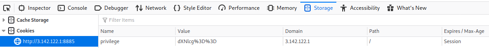
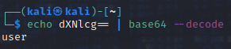

# Under Development

There is nothing obvious on the website so let's check the Source:
```html
<!DOCTYPE html>
<html lang="en">
<head>
    <meta charset="UTF-8">
    <meta name="viewport" content="width=device-width, initial-scale=1.0">
    <title>Web App Home Page</title>
</head>
<body>
    <div> This web app is still under development. </div>
    <!--TODO: Develop auth, buy some cookies from the supermarket-->
</body>
</html>
```
A comment about cookies? Let's inspect the cookie:



So we have a session cookie:
```
dXNlcg%3D%3D
```
The `%3D` is url encoded for `=` so this already looks a lot like base64, let's decode it and check.



So it says user. Let's change that to something more privileged like `admin`. Base64 encode `admin` and just insert in into your session cookie.
Refreshing the site now displays the flag:
```
SHELL{0NLY_0R30_8e1a91a632ecaf2dd6026c943eb3ed1e}
```