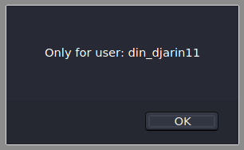
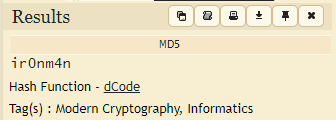

# Login

Visiting the webpage we can only see a login form asking for username and password, if we just try: `test:test` a windows pops up:



From this we know one thing for sure: there is a javascript checking the login form and the username might be `din_djarin11`. Let's have a look at the main.js:

```js
function checkIt() {
  var user = document.getElementById("username").value; var pass = document.getElementById("password").value;
  if (user != "din_djarin11") alert("Only for user: din_djarin11"); else {
    var s = Hash(pass);
    if (s == "9ef71a8cd681a813cfd377817e9a08e5") window.location = "./" + pass; 
    else alert("Invalid login");
  }
}
[...]
```
So we can see the password hashed and also that once we login correctly the form just redirects us to another site with the password as it's filename.

There is also the hashing function displayed in the main.js which is just a custom md5 hashing function.

Let's try to crack the hash with: https://www.dcode.fr/hash-function



Now we can just visit https://3.142.122.1:8889/ir0nm4n and download the flag:
```
SHELL{th1s_i5_th3_wa7_845ad42f4480104b698c1e168d29b739}
```